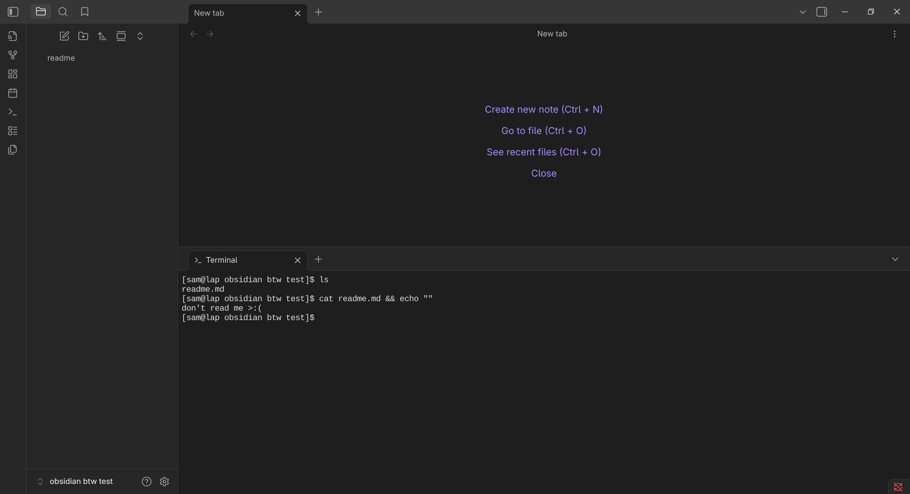
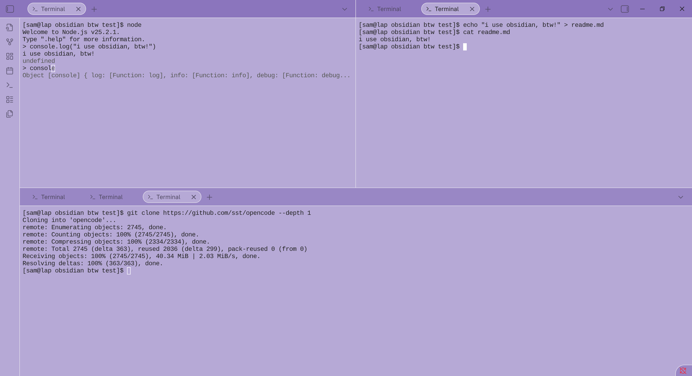
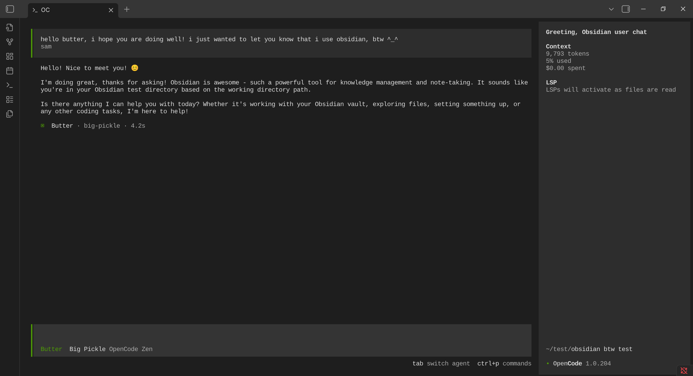

## obsidian, btw!

this is my attempt at turning [obsidian](https://obsidian.md/) into an [ide](https://en.wikipedia.org/wiki/Integrated_development_environment), because why not?

right now only the terminal features work

this is how it looks right now :

- single terminal demo

- multiple terminals with [colored candy](https://github.com/Erallie/colored-candy) theme demo

- [opencode](https://opencode.ai/) inside terminal demo

### development setup

1. clone this repo into your vault's `.obsidian/plugins/` directory
2. run `bun install`
3. run `bun run dev` for development (watches for changes)
4. run `bun run build` for production build
5. enable the plugin in obsidian settings

### release wise new features

`0.0.1`
- [x] terminal
- [x] tabs for terminal
- [x] made sure nvim and opencode work
- [x] made sure theme colors work

### future release plans

- [ ] allow any file extension to open in obsidian
- [ ] add proper lsp integration
- [ ] might use codemirror for this??
- [ ] add git panel
- [ ] add opencode panel
  - [ ] add custom folder for opencode config
  - [ ] add tools for opencode
  - [ ] add obsidian agent as the default
